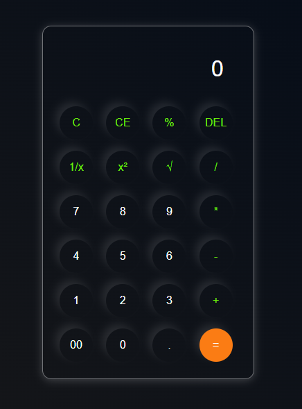

# calculator

An advanced web-based calculator that supports basic calculations as well as advanced functions such as squaring, square root, and reciprocal, designed using HTML, CSS, and JavaScript.

## Features Basic Arithmetic:

Support for Addition, Subtraction, Multiplication, and Division.Advanced Math Functions:

### Square:

Calculate $x^2$ with a single click.

### Square Root:

Instant calculation of $\sqrt{x}$.

### Reciprocal:

Quick calculation of the $1/x$ (division by x) function.

### Responsive Design:

Fully optimized for desktops, tablets, and mobile phones.
User Experience: Includes hover effects, active button states, and a clear display for results.

## 🚀 Technologies Used

HTML5: For the structural layout of the calculator.
CSS3: For styling, Flexbox/Grid layouts, and modern UI design.
JavaScript (ES6+): For the computational logic and DOM manipulation.

## 🛠️ How to Use:

1.Clone the repository:
git clone https://github.com/DaniaSalamhdr4/calculator.git

2.Open the project:
Navigate to the project folder and open index.html in your favorite web browser.

## 👥 Authors

- **Dania Salama** - [DaniaSalamadr4](https://github.com/DaniaSalamhdr4)
- **Dani Mhnna** - [danimhnnamhnna-del](https://github.com/danimhnnamhnna-del)
